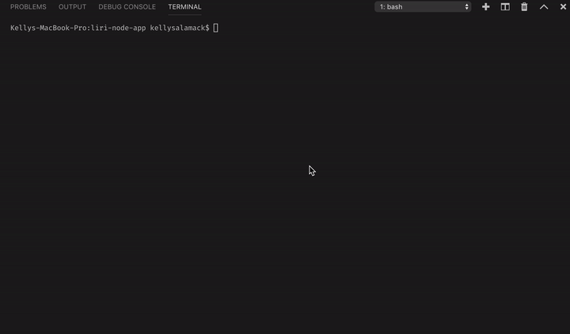

# liri-node-app

LIRI is a _Language_ Interpretation and Recognition Interface. LIRI will be a command line node app that takes in parameters and gives you back data.

### Concert Search:

✅ `node liri.js concert-this '<band name here>'`

* This command will search the Bands in Town Artist Events API for an artist and render the following information about each event to the terminal:

    * Name of the venue

    * Venue location

    * Date of the Event (use moment to format this as "MM/DD/YYYY")

### Spotify Search:

✅ `node liri.js spotify-this-song '<song name here>'`

   * This will show the following information about the song in your terminal/bash window

     * Artist(s)

     * The song's name

     * A preview link of the song from Spotify

     * The album that the song is from

   * If no song is provided then your program will default to "The Sign" by Ace of Base

### IMDB Search:

✅ `node liri.js movie-this '<movie name here>'`

   * This will output the following information to your terminal/bash window:

       * Title of the movie.
       * Year the movie came out.
       * IMDB Rating of the movie.
       * Rotten Tomatoes Rating of the movie.
       * Country where the movie was produced.
       * Language of the movie.
       * Plot of the movie.
       * Actors in the movie.

   * If the user doesn't type a movie in, the program will output data for the movie 'Mr. Nobody'

### Do What It Says:

✅ `node liri.js do-what-it-says`

   * Using the `fs` Node package, LIRI will take the text inside of random.txt and then use it to call one of LIRI's commands.

     * It should run `spotify-this-song` for "I Want it That Way," as follows the text in `random.txt`

